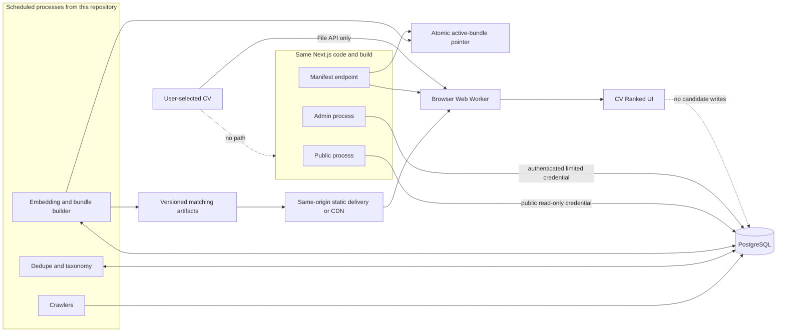

# Xtelo hosted edition and private browser matching

**Status:** final implementation handoff and proposed concept amendment

**Prepared:** 2026-09-23

**Audience:** Claude Code implementing on phase branches; Codex reviewing every commit and completed branch

**Authority:** before production implementation, merge the accepted decisions into `docs/scraplify-concept.md` and create evidence-based phase entries in `docs/STATUS.md`. The concept document remains the repository's source of truth.

**Reconciled:** 2026-09-23 — this file's decisions are summarized and made authoritative in `docs/scraplify-concept.md` §30. *(That reconciliation recorded Phase 8 as planned/not-started per this file's §2 precondition — true on 2026-09-23 when this note was written, no longer true: 8A is merged and 8B is in progress. `docs/STATUS.md`'s current-phase section is the actual-progress record; check there, not this line.)* This file is kept in full as the implementation handoff Phase 8A–8E build against — §13's stage-by-stage deliverables, §14's test/gate lists, and §19's references are not duplicated in the concept doc. Do not delete this file or let it silently drift from §30; if a decision recorded here changes, update §30 in the same change.

## 1. Decision summary

Build the hosted service and the individually cloned product from **one repository and one codebase**. Do not fork the repository and do not maintain permanent `local` and `hosted` Git branches.

- A **local/operator surface** keeps the current complete workflow: crawling, health, review queues, stored profiles, rankings, shortlist and outreach drafts.
- A **public surface** exposes the catalogue and privacy-first browser CV matching.
- An **admin surface** exposes operational health and human review behind authentication.
- In production, public and admin run as separate profiles/processes from the same build. The public process possesses neither admin secrets nor an admin database credential.
- Shared domain modules, migrations, source adapters and tests remain common.
- Work continues through short-lived phase branches merged into `main`.

A GitHub fork is useful for a separately owned derivative or an outside contributor. It is the wrong tool for two maintained editions of the same product because security, crawler, schema and correctness fixes would drift.

The hosted public navigation is:

`Browse | Listings | CV Ranked`

The logo links to `/`. The existing landing page gains a CV chooser. Processing continues in browser memory while client-side navigation opens `/cv-ranked`, where the user sees progress, corrects the locally derived profile and gets ranked opportunities.

### Privacy promise

Use this precise promise:

> The selected CV is read and analysed in this browser. Xtelo does not intentionally upload or store the file, extracted text, profile, embedding or ranking results. Closing or refreshing the tab clears the current session. Public model files and the vacancy index may remain in the browser cache.

Do not say that the CV is forensically “deleted.” Browser/OS memory, crash reporting and swapping are outside the application's control. The enforceable promise is no intentional transmission or persistence.

### Cost outcome

| Work | Current local/operator flow | Hosted public flow |
| --- | --- | --- |
| Crawl, normalize, dedupe, taxonomy | No LLM call | No LLM call |
| CV claim extraction | One paid Opus call per submitted CV | Local parser/taxonomy/model; no API call |
| Ranking | Deterministic server computation | Local deterministic and semantic computation |
| Vacancy embeddings | Not implemented | Scheduled self-hosted model computation; no embedding API |
| Outreach drafting | One deliberate paid Opus call | Not part of the public product |

The target is **zero LLM API spend per visitor and zero LLM API spend for vacancy embeddings**. There will still be ordinary hosting, CPU, artifact-storage and bandwidth costs. Any future cloud-CV fallback must be explicit-consent, separately metered and rate-limited.

## 2. Repository state and branch precondition

This revision was checked against `phase-6-outreach-drafts` at commit `f089150`. The worktree was clean before this file was added, but Phase 6 was not yet merged into `main`.

Before Phase 8 starts:

1. Prefer finishing review and merging Phase 6, updating local `main`, and branching from reviewed `main`; or
2. If Phase 6 remains open, create a separate worktree from reviewed `main` and start Phase 8 there.

Do not base Phase 8 accidentally on unmerged Phase 6 history, do not mix the two programmes in one branch, and do not discard work to obtain a clean tree.

## 3. Verified current baseline

This is an adjustment to the existing product, not a greenfield rewrite.

### Stack

- Node.js 24+, TypeScript 7 ESM.
- Next.js 16.3 App Router and React 19.
- PostgreSQL through Drizzle ORM; `pg_trgm` already supports fuzzy candidate generation.
- Tailwind CSS 4, Biome, Vitest and Playwright.
- Cheerio/Undici source adapters, PowerShell scheduled wrappers and Pino logs.
- Anthropic is currently used for deliberate CV extraction and outreach drafting only.

The modular monolith is the right base. Do not introduce microservices, Redis, a hosted vector database, Kubernetes, a new web framework or a job broker without measured need.

### Existing durable flow

`source -> crawl run -> source listing + revisions -> canonical opportunity + memberships -> taxonomy/deduplication -> browse/rank`

The schema already preserves source provenance, immutable revisions, duplicate evidence, taxonomy mappings, crawl incidents, candidate profiles and versioned rankings. Phase 7A already provides scheduled crawl wrappers, health evaluation, stale-run detection, incident visibility and backup scripts. Extend these instead of building parallel operations.

### Existing CV flow

The current `/profile` flow is server-side:

1. The browser uploads a PDF or DOCX through a Server Action.
2. Mammoth extracts DOCX text; PDF bytes go to Anthropic.
3. One `claude-opus-5` request creates structured claims.
4. Claims/evidence are stored as a versioned PostgreSQL profile.
5. Deterministic hard filters and component scores create cached rankings.

This remains a valid, consented local/operator capability. It must not be silently reused by the hosted public UI because it conflicts with browser-only privacy and zero-per-CV API cost.

### Existing screens

Current routes include `/`, `/opportunities`, `/listings`, `/profile`, `/ranked`, `/saved`, `/review`, `/taxonomy-review`, `/health` and `/drafts`. Hosted work is primarily separation, authorization and a new local matcher—not replacement of the crawler or catalogue.

## 4. Goals and non-goals

### Goals

1. Let visitors browse real, current, source-traceable opportunities without an account.
2. Let a visitor choose a CV once, process it locally, correct a local profile and see ranked opportunities.
3. Create no hosted candidate, claim or ranking rows for anonymous visitors.
4. Give the operator a protected control plane for crawling, parsing, dedupe, taxonomy, embedding/index publication and backups.
5. Preserve the clone-and-run local experience.
6. Serve last-known-good public data with visible freshness and a bounded stale policy.
7. Keep maintenance practical for one operator.

### Non-goals for first hosted release

- Visitor accounts, saved jobs, cross-device profiles or personalized alerts.
- Browser OCR for scanned PDFs.
- A browser generative LLM or public chat UI.
- Job applications, email sending or form submission.
- Approximate-nearest-neighbour infrastructure at current corpus size.
- LLM-made taxonomy or duplicate decisions.
- A second repository or permanent variant branch.
- Third-party browser analytics on the CV surface.

## 5. Product surfaces

### Public

| URL | Purpose | State/data |
| --- | --- | --- |
| `/` | Existing landing page plus local CV chooser | Public corpus facts; CV stays in client memory |
| `/opportunities` | Browse canonical, deduplicated opportunities | Read-only public server data with provenance |
| `/opportunities/[id]` | Canonical detail and contributing sources | Read-only public server data |
| `/listings` | Separate raw source postings | Public-safe current fields; no quarantine/internal incident details |
| `/cv-ranked` | Combined local profile editor and ranking | Memory-only client state plus public matching bundle |

Opening `/cv-ranked` directly or refreshing shows a chooser and explains that no prior session was retained. “Change CV” terminates the current worker and clears state before accepting another file. Do not place CV-derived values in URLs, cookies, `localStorage`, `sessionStorage`, IndexedDB or server caches in the first release.

`Browse` continues to mean canonical opportunities. `Listings` continues to mean distinct source records. Every canonical result retains an obvious path to its real sources.

### Admin

Deploy the admin profile at `admin.<domain>` and use a protected `/admin` namespace:

| URL | Responsibility |
| --- | --- |
| `/admin` | Actionable pipeline summary |
| `/admin/sources` | Crawl freshness, completeness, counts and parser incidents |
| `/admin/duplicates` | Duplicate review queue and evidence |
| `/admin/taxonomy` | Taxonomy review, unmapped values and backlog |
| `/admin/matching` | Model, embedding coverage, bundle build and publication |
| `/admin/incidents` | Open incidents, acknowledgement, resolution and history |
| `/admin/operations` | Scheduler, backups, safe manual triggers and audit trail |

The dashboard should show the real pipeline:

`Crawl -> Parse -> Normalize -> Dedupe -> Taxonomy -> Embed -> Publish`

Each stage reports last success, current status, backlog/failure count and next action. Do not invent “AI health scores.” Every number must come from durable evidence.

Profile, ranking, shortlist and drafts are personal/local features, not automatically admin features. In the public production profile their current routes must be unavailable.

### Local/operator

The default local workflow preserves current URLs and full navigation. It may use the existing Anthropic CV flow after explicit consent. The new private browser matcher should also be runnable locally for testing, but it must not replace current stored profiles until the evaluation proves quality.

## 6. Target architecture

Crawler, builder, public web and admin web may run as separate processes, but remain commands/modules in one repository. This gives useful isolation without distributed-system complexity.

### Runtime profiles

Introduce one validated server-only setting:

`XTELO_SURFACE=local | public | admin`

- `local`: current full experience, bound to loopback by default.
- `public`: minimal public navigation, public read-only DB credential, no admin auth secret, no local/admin routes.
- `admin`: authenticated control plane, no public CV route, only required additional DB permissions.
- A production reverse proxy maps public and admin hostnames to separate loopback ports/processes. This is deployment isolation, not a new service architecture.
- Every disallowed route returns `404`; hiding navigation is not access control.
- Each production profile fails closed if required DB, auth or artifact configuration is absent.
- No secret or access decision goes in `NEXT_PUBLIC_*`.
- A small `server-only` policy module owns surface checks.
- Sensitive pages, Route Handlers and Server Actions independently authorize at data access/mutation time. Layout/proxy checks are UX optimizations only.
- CI exercises all three profiles.
- `local` is never an acceptable unauthenticated internet deployment mode.

Next.js route groups may supply separate layouts without changing public URLs. Move one surface at a time with route tests; avoid one giant directory reshuffle.

## 7. Browser CV processing

### File handling

Use the File API and a dedicated Web Worker. The main thread transfers the chosen file/bytes to the worker; parsing, embedding and ranking stay off the UI thread.

- PDF: pinned, self-hosted PDF.js worker for text PDFs.
- DOCX: Mammoth's browser `arrayBuffer` input.
- Check extension and magic bytes.
- Start with the existing 8 MiB file ceiling and also cap pages, extracted characters, decompressed DOCX size and processing time.
- Reject encrypted, malformed, oversized and image-only files with useful local messages.
- Do not upload scanned PDFs for silent cloud OCR; ask for a text PDF/DOCX.
- Terminate the worker on cancel, replacement, timeout, navigation away and cleanup.
- Dynamically import model/runtime code inside the worker; landing and ordinary Browse visits must not download it.

File name, text, claims, vectors and results never enter application/error logs. Worker errors crossing to the UI are bounded codes, not raw exceptions that may echo document content.

### Local profile extraction

The current Opus extractor will be richer than a small browser model. Do not claim feature parity.

The practical first release:

1. Extract/normalize text locally while preserving Georgian and grapheme boundaries.
2. Split into bounded sections/chunks.
3. Match controlled role, skill, language and location aliases from existing taxonomy.
4. Let the user add/remove/correct roles, skills, language, location and work-mode preferences.
5. Treat explicit choices as hard filters; never infer disqualification from weak text evidence.
6. Embed CV chunks and confirmed role intent locally for retrieval.

A semantic vector alone cannot justify “you have skill X.” Show a claim only with supporting local text or explicit user confirmation.

### Model contract

Vacancy and CV vectors are comparable only when produced by the **same exact contract**:

- pinned model files and upstream revision;
- tokenizer and files;
- quantization/runtime variant;
- prefixes such as `query:` and `passage:`;
- truncation/chunking;
- pooling/normalization;
- output dimension and numeric encoding.

Do not buy API embeddings for vacancies while using an unrelated browser model for CVs. Use one pinned, redistributable multilingual ONNX model in the scheduled Node builder and browser worker. WebGPU is an optimization; WebAssembly is the compatibility baseline.

`multilingual-e5-small` is a candidate, not a decision. Georgian/English quality, license, transfer size, latency and memory must win Phase 8A. Self-host all model/tokenizer/WASM assets, disable remote model downloads and record their hashes/license. Load them only after explicit matching intent with honest progress and cancellation.

### Ranking

1. The server bundle includes only records accepted by one shared public-eligibility policy. Bundle and Browse queries import the same policy rather than duplicating lifecycle status lists.
2. Apply explicit user hard filters locally.
3. Retrieve with cosine similarity against current canonical opportunity vectors.
4. Combine semantic evidence with versioned deterministic role/skill/taxonomy signals.
5. Explain results only through real listing fields, explicit choices and traceable local matches.

Do not freeze weights in this plan. Choose/version them using the evaluation set. The UI distinguishes exact filter/term matches from the less-explainable overall semantic similarity.

At a few thousand opportunities, exact typed-array dot products in a worker are simpler than ANN. As an order-of-magnitude reference, 4,000 x 384 float32 vectors are about 6.1 MB before metadata. Reconsider partitioning/ANN only if the compressed artifact exceeds 25 MB or ranking exceeds 250 ms at p75 on the agreed baseline device.

## 8. Vacancy embeddings and matching bundle

### Embedding input

Embed one current canonical opportunity representation, not every duplicate source row. Deterministically combine:

- canonical title;
- organization if known;
- source descriptions with their source boundaries retained;
- normalized taxonomy;
- location, language and work-mode only when actually present.

Hash this as `semantic_input_hash`. Status/freshness changes rebuild the bundle but need not recompute a vector if semantic content is unchanged. A changed contributing revision must produce a new hash/vector or be demonstrably outside semantic input.

### Storage decision

Do **not** add `pgvector` merely because embeddings exist. Public ranking occurs in the browser and the corpus does not justify an ANN database index.

This deliberately amends the concept's current “add `pgvector` when semantic matching begins” statement. The narrower rule becomes: **add `pgvector` when evaluated server-side vector search begins**.

Recommended portable schema:

- `embedding_models`: immutable contract, upstream revision, license, dimension, prefixes, pooling, normalization and hashes.
- `opportunity_embeddings`: opportunity/revision/model, semantic input hash, float32 bytes (`bytea`), dimension and timestamps; unique on exact input/model.
- `matching_bundle_builds`: model, corpus watermark, state, counts, artifact metadata/checksums, timing and bounded error code.
- `matching_bundle_publications`: active bundle pointer, activation/retirement, actor/worker and rollback relation.

Validate vector byte length, dimension and finite values at every boundary. Add `pgvector` later only for measured server queries, starting with exact search; add HNSW only from latency/recall evidence.

### Artifact contract

Use a `MatchingArtifactStore` interface. The first deployment can use a persistent local directory served from the same origin; object storage/CDN is a deployment adapter, not a domain redesign.

Each immutable version includes:

- `manifest.json`: schema, bundle/model IDs, generated time, corpus watermark, source freshness, counts, dimensions and SHA-256 hashes;
- compact vectors;
- public render metadata: opportunity/revision, title, organization, type, location, deadline, taxonomy/features and provenance;
- no incidents, internal review evidence, candidate data or unpublished/quarantined rows.

`GET /api/matching/manifest` returns the active pointer with short/no caching. Versioned files use immutable long caching. The client never combines different bundle/model versions.

Build a new version, verify counts/checksums/parity, then atomically activate it. Failure keeps the prior version. Retain the active bundle and at least two verified predecessors. Garbage collection never removes the active or a rollback target.

Manifest and client declare schema compatibility ranges. Support the current and immediately previous compatible schema during rolling deploys. An incompatible client refuses matching while keeping Browse usable.

Last-known-good does not mean “serve obsolete matches forever.” The concept amendment chooses a maximum acceptable bundle/source age based on real crawl schedules. Beyond it, `/cv-ranked` stops matching and explains the temporary unavailability; before it, show actual build time and degraded-source warnings.

## 9. Admin authentication and database separation

### Authentication

Use a maintained auth library or upstream identity provider; do not build passwords. Default to OIDC/OAuth with an allowlisted immutable provider subject and MFA enforced by the provider.

- Secure, `HttpOnly`, `SameSite` cookies.
- Re-check identity in every protected page/action/handler.
- Fail closed on auth/provider error.
- Rate-limit login/mutation paths at proxy/provider layer.
- Audit mutations without sensitive payloads.
- Use `admin.<domain>` and the `admin` process; the public process has no provider secrets.

### Database roles

- Public web role: `SELECT` only on explicit public views/queries.
- Admin role: only implemented review/operations mutations.
- Worker role: crawl, dedupe, taxonomy, embedding and publication writes.
- Migration role: DDL during deployment only.

`XTELO_WRITES_ENABLED` remains a safety switch, not authorization. The public process receives no write-capable connection string, so a misconfigured flag cannot grant writes.

## 10. Reliability and observability

Extend existing health logic. Required evidence:

- Last attempted/successful crawl per source.
- Full-coverage freshness and incomplete-run cause.
- Discovered, changed, failed, quarantined, expired and reopened counts versus baselines.
- Parser incidents and count anomalies.
- Unlinked listings, duplicate-review backlog and taxonomy backlog.
- Model version and missing/failed/stale embedding counts.
- Bundle duration/result/checksum, active age and rollback target.
- Public synthetic probes for landing, Browse, detail, manifest and artifact download.
- Scheduler heartbeat and latest restorable backup evidence.

The builder runs only after dedupe and taxonomy settle for its crawl watermark. It takes an advisory lock, refuses publication when upstream health gates fail and records why the prior bundle remained active.

Manual admin triggers accept no arbitrary command/source string. They invoke fixed operations, confirm intent, respect concurrency/rate limits and audit actor/outcome.

Use structured server logs and current health commands first. Add server OpenTelemetry only when cross-process diagnosis needs it. Browser instrumentation is out of scope because it adds privacy/supply-chain risk.

Never log CV/file text, vectors, claims, visitor-ranked IDs or personal query parameters. Add one operator-selected push alert channel only after health signals are stable; alerts need deduplication, recovery notification and runbook links.

## 11. Security and privacy

Update `docs/THREAT_MODEL.md` before public matching. Cover:

- malicious PDF/DOCX, zip bombs and memory exhaustion;
- XSS as CV exfiltration;
- model/WASM compromise or artifact mismatch;
- third-party scripts/analytics/error reporting;
- admin session theft, CSRF and missing action authorization;
- public/private query confusion and internal leakage;
- DoS against DB queries/artifacts;
- poisoned/stale publication;
- source republishing rights and model redistribution license.

Controls:

- strict CSP; CV pages connect only to required same-origin assets/endpoints;
- self-host fonts, model, tokenizer, PDF worker and WASM;
- no third-party script on the CV surface;
- restrictive `worker-src`;
- pinned dependencies/revisions and manifest checksums;
- resource/time limits and worker termination;
- never render extracted CV content as HTML;
- safe external links and output escaping;
- immutable artifact versions and atomic publication;
- authorization and audit on every admin mutation.

Public deployment is gated on documented permission/terms for crawling and republishing each source. Technical access is not publication authority.

## 12. Model evaluation gate

Create a privacy-safe evaluation set. Never commit an identifiable real CV or excerpt.

Recommended minimum:

- 15+ representative synthetic/properly anonymized Georgian, English and mixed-language profiles;
- 300+ human-labelled profile/opportunity judgments from real traceable listings;
- hard negatives: senior/junior mismatch, same title/different field, location/language conflict;
- held-out labels not used for weight tuning.

Compare lexical/taxonomy, current deterministic scoring where comparable, candidate embedding models and the hybrid. Report Recall@20, NDCG@10, hard-filter violations, transfer size, cold/warm load, embedding/ranking time and peak memory on agreed desktop and mid-range mobile browsers.

Predeclare acceptance before final tuning. A sensible starting gate is zero hard-filter violations, Recall@20 >= 0.90 on strong matches, and meaningful held-out NDCG@10 improvement over lexical baseline.

If no model meets Georgian quality and browser budgets, do not label weak output “semantic matching.” Ship an honest lexical/taxonomy fallback or make the heavier semantic mode opt-in with download size stated.

## 13. Phased implementation

One branch per sub-phase, with focused commits, status evidence and whole-branch review.

### Phase 8A — private matching feasibility

**Branch:** `phase-8a-private-matching-spike`

Deliver concept/status amendment, evaluation corpus/harness, candidate license/revision record, Node/browser golden-vector parity, isolated worker proof for PDF/DOCX/inference, and measured quality/size/latency/memory.

Do not add a public route, migration or production dependency until the spike proves the choice.

**Exit:** one acceptable contract meets declared quality/performance and parity tolerance, or the branch records an honest lexical-first decision.

### Phase 8B — surfaces and admin boundary

**Branch:** `phase-8b-surface-admin-boundary`

Deliver validated `local|public|admin` configuration, layouts/nav, auth integration, admin dashboard and migrated health/duplicate/taxonomy screens, direct-route enforcement, public-safe query boundary, database roles/views and admin audit foundation.

**Exit:** unauthenticated/public requests cannot read or mutate local/admin resources by direct URL or crafted action; local workflows remain intact.

### Phase 8C — matching bundle

**Branch:** `phase-8c-matching-bundle`

Deliver schema/migrations, incremental embedding by semantic hash, artifact store/manifest, validation and atomic activation/rollback, admin matching health, CLI health integration and immutable delivery. Integrate with crawl scheduling only after standalone idempotency.

**Exit:** interrupted/incompatible builds never replace active data; each published row maps to a current public canonical revision and real source.

### Phase 8D — browser CV Ranked

**Branch:** `phase-8d-browser-cv-ranked`

Deliver lazy self-hosted worker, memory-only provider, landing chooser and client navigation, combined profile/preferences/results UI, cleanup states, hybrid ranking/explanations, failures/fallback and privacy/no-network tests.

**Exit:** a canary CV produces only allowlisted same-origin `GET` requests for public assets—no upload/mutation—and leaves no canary text, file metadata, candidate row or ranking in server logs/database.

### Phase 8E — hosted readiness

**Branch:** `phase-8e-hosted-readiness`

Deliver production runbook/restore rehearsal, least-privilege secrets, schedules/heartbeats, two hosted profiles/domains, TLS/CSP/rate limits/probes, alert channel, load/accessibility/security evidence, rights/licenses and rollback drills.

**Exit:** every release item has current evidence. A local demo is not hosted readiness.

## 14. Tests and review gates

### Automated

- Normalization, chunking, taxonomy aliases, filters, explanations and manifest validation.
- Node/browser golden-vector parity with non-personal fixed text.
- Malformed dimension, NaN/infinite and model-version mismatch tests.
- Empty, malformed, encrypted, oversized, image-only and decompression-heavy documents.
- Embedding idempotency, stale replacement, interrupted build, activation and rollback.
- Auth tests for every admin page/action/handler.
- `public` denial of all local/admin routes and `admin` denial of public CV routes.
- Public-query tests preventing incident, review, quarantine and candidate leakage.
- Playwright network tests proving no external request or CV body.
- Existing crawl/dedupe/taxonomy/profile/ranking/outreach suites stay green.

### Browser/frontend

Inspect at 390, 768, 1280 and 1920 CSS pixels with real Georgian/English corpus data:

- no horizontal overflow;
- keyboard operation, skip link, visible focus and accessible labels;
- download/progress/cancel/empty/stale/offline/failure states;
- Georgian uses Noto Sans Georgian, no uppercase/letter spacing, and grapheme-safe/CSS truncation;
- landing is the sole cinematic hero; catalogue/admin/results remain dense and task-oriented;
- no invented listings, employers, claims, metrics, health states or explanations;
- provenance always visible.

### Performance gates for Phase 8A

- Landing/Browse do not download model or vector data.
- Assets load lazily with visible progress.
- Target warm first results <= 5 s and cold <= 20 s on agreed mid-range device, with cancellation.
- Ranking stays off main thread.
- Reassess if mobile memory exceeds the agreed budget, artifact exceeds 25 MB compressed, or ranking exceeds 250 ms p75 after model load.

## 15. Deployment and rollback

Keep migrations additive. Do not delete current candidate/ranking tables or local routes during hosted launch.

Release:

1. Apply additive schema without public behavior change.
2. Build embeddings/unpublished bundle after crawl/dedupe/taxonomy watermark settles.
3. Verify counts, checksums, sample provenance and parity.
4. Deploy protected admin and public route policy with separate credentials.
5. Activate bundle.
6. Enable public CV entry.
7. Observe probes/health before announcement.

Rollback:

1. Disable CV entry while leaving Browse/Listings available.
2. Repoint publication to prior verified bundle.
3. Roll back web artifact.
4. Leave additive tables unless a separately reviewed migration is necessary.

A crawler, builder or admin outage must not unnecessarily remove the last-known-good public catalogue.

## 16. Deferred decisions

These do not block Phase 8A:

- hosting provider and persistent disk versus object-store adapter;
- final identity provider;
- winning multilingual model/quantization;
- hybrid weights;
- future opt-in “remember on this device”;
- later need for `pgvector`, sharding, ANN or a durable queue.

Defaults: one repo, modular monolith, exact browser ranking, filesystem artifact adapter, external MFA-capable identity, memory-only CV state and no `pgvector`.

## 17. Rejected alternatives

| Alternative | Reason |
| --- | --- |
| Fork/new hosted repository | Duplicates schema/crawler/security fixes and drifts |
| Permanent hosted branch | Creates continual merge debt and two sources of truth |
| Send public CV to Opus | Recurring cost and contradicts strict privacy; retain only local/explicit future fallback |
| Send only local CV embedding | Still transmits derived personal data |
| API vacancy vectors plus different browser model | Embedding spaces are incomparable |
| Browser generative LLM | Excessive size, memory, compatibility and maintenance |
| Immediate `pgvector`/HNSW | Browser exact search meets current scale |
| Temporary anonymous profile storage | Adds breach/deletion/abuse obligations without product value |
| Put every current page under admin | Profile/rank/drafts are personal local features, not operations |
| Trust layout/proxy auth | Pages, handlers and actions remain independent security surfaces |
| One hosted process with both credentials | Public compromise would expose admin secrets; two profiles are cheap isolation |

## 18. Claude kickoff

Claude starts with Phase 8A only:

1. Ensure Phase 6 is reviewed/merged or use a clean worktree from reviewed `main`.
2. Create `phase-8a-private-matching-spike`.
3. Amend concept/status before code.
4. Pin candidate revisions and document redistribution license.
5. Build evaluation harness and isolated worker proof behind no public route.
6. Record Georgian/English quality, size, latency, memory and Node/browser parity.
7. Run typecheck, lint, relevant tests and real-browser inspection.
8. Request per-commit Codex review and whole-branch adversarial review.

Do not mix Phases 8B–8E into this branch, push without explicit owner approval, or claim hosted readiness from local success.

## 19. Primary references

- [Next.js authentication guide](https://nextjs.org/docs/app/guides/authentication)
- [Next.js self-hosting guide](https://nextjs.org/docs/app/guides/self-hosting)
- [Transformers.js WebGPU guide](https://huggingface.co/docs/transformers.js/guides/webgpu)
- [Transformers.js custom/self-hosted usage](https://huggingface.co/docs/transformers.js/custom_usage)
- [Transformers.js Node tutorial](https://huggingface.co/docs/transformers.js/en/tutorials/node)
- [ONNX Runtime Web](https://onnxruntime.ai/docs/tutorials/web/)
- [PDF.js](https://github.com/mozilla/pdf.js/)
- [MDN File API](https://developer.mozilla.org/en-US/docs/Web/API/File_API/Using_files_from_web_applications)
- [MDN Web Workers](https://developer.mozilla.org/en-US/docs/Web/API/Web_Workers_API/Using_web_workers)
- [Mammoth browser usage](https://github.com/mwilliamson/mammoth.js#usage)
- [pgvector](https://github.com/pgvector/pgvector)
- [OpenTelemetry JavaScript](https://opentelemetry.io/docs/languages/js/)
